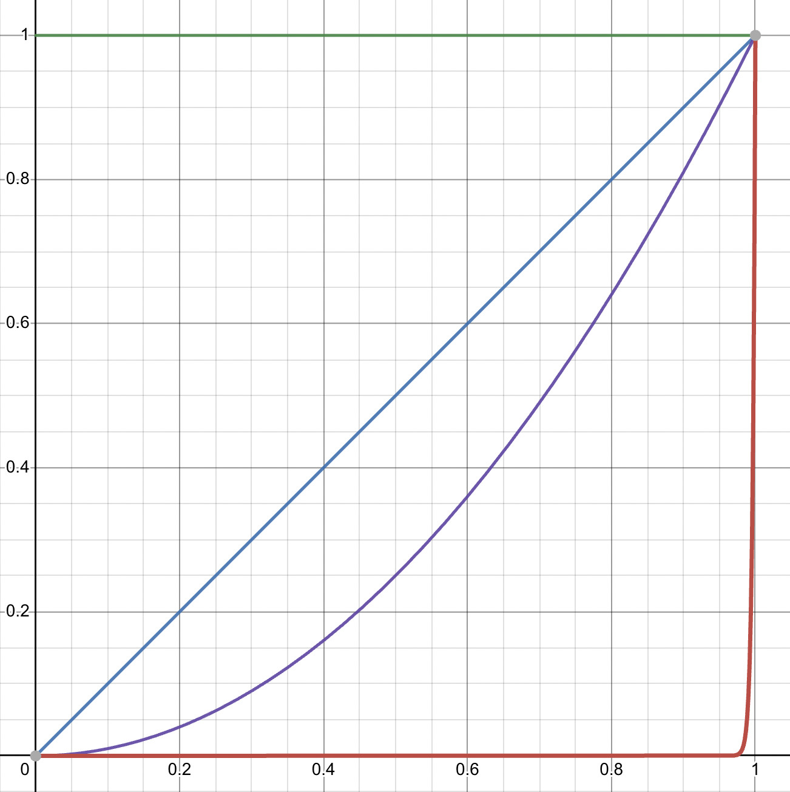

# Zerem

`Zerem` ("*Flow*" in Hebrew) is a DeFi Circuit Breaker and Funds Router that protects protocols from loss of funds due to exploits and other forms of errors.

## Installing

```
git clone https://github.com/hananbeer/zerem
cd zerem
forge install
```

## Building

```
forge build
```

## Testing

Test everything with maximum verbosity:
```
forge test -vvv
```

Test a specific test suite:
```
forge test -vvv --match Zerem
```

## Description

Existing dApps (e.g. Cross-Chain Bridges) normally cannot protect from loss of funds. Often a single transaction is able to cause massive loss of funds at the moment it is committed to chain and leave no window of opportunity to take counter measures.

Past events have shown that even as little as 30 minutes can have massive impact on protecting funds in case of critical protocol failures.

`Zerem`'s circuit breaker works by routing funds based on predefined configuration: transfers below a certain threshold are transferred directly with no further action, however above this threshold funds are locked in a temporary vault (that is separate from the protocol's vault) and locked for the preconfigured duration.

`Zerem` does not hold protocol funds, it only temporarily holds funds that have already exited the protocol, thus pose no security risk to existing funds.

The locking mechanism implements a delayed gradual release which is defined by:

$f(t) = (\dfrac{\Delta t - d}{p})^n$

Which gives the fraction of funds released (unlocked), where:
- $\Delta t$ is how much time passed since funds were locked
- $d$ is the delay period where no funds are released
- $p$ is the period during which funds should be gradually released

The amount of unlocked funds is:

$u(x) = f(t) * x$

Where $x$ is the amount of funds locked. (note that while not shown above, $f(t)$ is clamped to the range $[0, 1]$)



The following graphs show various gradual release functions $f(t)$:

- Constant (x^0 in green)
- Linear (x^1 in blue)
- Parabolic (x^2 in purple)
- Hyper-exponential (x^255 in red)

Additionally a liquidation resolver is specified - an address which receives disputed funds. It can be a governance contract, a neutral mediator multisig, etc.

It is not recommended to return the funds to the originating protocol since a dispute may indicate a flaw in the protocol hence funds should be temporarily moved to a safe haven.

## Integration

Integrating `Zerem` is as easy!

Simply replace the target address `to` in `Token.transfer(to, amount)` or `Token.transferFrom(from, to, amount)`
 to the `Zerem` contract instead then call `Zerem.transferTo(to, amount)`

NOTE: `Zerem` is under active development and is subject so changes. There is currently no off-chain automatic release daemon and the token factory is partially implemented.

There are no production deployments on any chain at the moment.

## Security

`Zerem` does not hold protocol funds. It only temporarily holds funds that have already exited the protocol, and only above a certain threshold such that for the majority of retail users there is virtually zero exposure in terms of risk and friction. Above the threshold, funds are held only temporarily with a well-defined immutable configuration, including release parameters and the liquidation resolver.

`Zerem` will never keep user's funds locked beyond the configured period, will never allow modifications to this configuration or to the liquidation resolver, and

## Limitations

While `Zerem` protects protocols from unwanted outflow of funds such as certain exploits, rogue governance attacks, bad configuration and many other security flaws, there is a trade-off.

Since `Zerem` does not hold protocol funds, it can only protect funds that are routed through it. It does not offer protection from certain rare type of security vulnerabilities such as arbitrary calls or delegatecalls (LiFi), approval manipulation (AnySwap), direct minting (Binance) and possibly other unique flaws.
